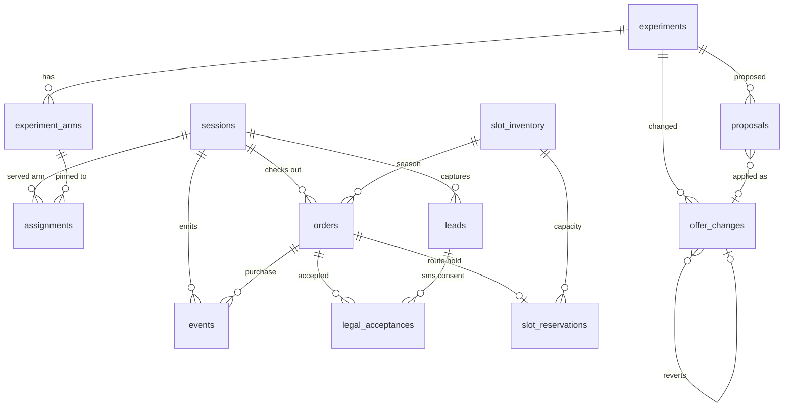

# Winter Pass database schema

Migration: `supabase/migrations/0003_winter_pass.sql`. Seed:
`supabase/seed/0002_winter_pass.sql`. Smoke test: `npm run db:smoke`
(runs in CI against Postgres 16).

**Access model.** Every table has RLS enabled and no policies, and `anon` /
`authenticated` have no grants. Only the server touches these tables through
the service role (Next.js route handlers, Vercel cron, Supabase functions).

## Tables

| Table | Purpose | Key columns |
| --- | --- | --- |
| `sessions` | One row per visitor; owns UTMs, gclid, device, referrer, zip, hashed IP, 72h pin expiry | `id`, `expires_at`, `utm_*`, `gclid`, `ad_group`, `ip_hash` |
| `experiments` | Mirror of `experiments.yaml` (synced by code, never hand-edited) | `key`, `scope`, `status`, `bounded_by` |
| `experiment_arms` | Arm payload + current bandit weight; `active=false` still gets the 5% floor | `(experiment_key, arm_id)`, `payload`, `weight`, `source` |
| `assignments` | Which arm each session saw; pinned until `pinned_until` or purchase | `(session_id, experiment_key)`, `arm_id`, FK to the arm |
| `events` | First-party analytics. Name is a CHECK-constrained enum of the 14 spec events plus `checkout_error` | `name`, `ts`, `variants`, `utm`, `props`, `revenue_cents`, `plan`, `payment_type`, `order_id` |
| `slot_inventory` | Opening capacity per season for the Schedule Hold | `season`, `total_slots` |
| `slot_reservations` | One per order: `held` (with expiry) → `confirmed` on payment, or `released` | `order_id` (unique), `status`, `expires_at` |
| `orders` | One per checkout attempt. Snapshots the prices shown, pinned variants, UTMs, and the legal hashes + timestamp + IP accepted. Stripe and GoHighLevel ids. Referral codes | `plan`, `payment_type`, `*_price_cents`, `total_cents`, `variants`, `legal_hashes`, `legal_accepted_at`, `legal_accepted_ip`, `stripe_*`, `ghl_*`, `referral_code` |
| `legal_acceptances` | Audit row per document per acceptance (checkout or SMS lead); hash must be 64 hex chars | `document`, `content_hash`, `purpose`, `ip`, `user_agent` |
| `leads` | Exit-intent, scroll-depth, price-sheet, and waitlist captures with SMS consent hash | `source`, `phone`/`email`, `sms_consent`, `sms_consent_hash` |
| `optimizer_state` | Singleton: `running` / `paused` / `killed`, reason, last known best config | `status`, `last_known_best`, `last_run_at` |
| `offer_changes` | Every optimizer/owner/guardrail change with before/after; revert links back | `kind`, `before`, `after`, `reverted_at`, `reverted_change_id` |
| `proposals` | Weekly proposals; auto-applied or awaiting "approve" | `report_date`, `payload`, `auto_appliable`, `status` |
| `weekly_reports` | Report markdown, the SMS summary, metrics, guardrail actions | `report_date`, `markdown`, `summary_sms` |
| `webhook_events` | Idempotency for Stripe and GoHighLevel deliveries | `(provider, event_id)` unique, `processed_at`, `error` |

## Functions (all capacity math lives in the database)

| Function | Behavior |
| --- | --- |
| `remaining_slots(season)` | `total_slots` minus confirmed holds minus unexpired `held` rows. Never below 0. This is the only number the site may display. |
| `reserve_slot(order_id, season, ttl = 30 min)` | Locks the season row, raises `sold_out` (SQLSTATE P0001) when none remain, else upserts a `held` reservation. |
| `confirm_slot(order_id)` | On Stripe payment success. |
| `release_slot(order_id)` | On failure, refund, or cancellation. |
| `expire_slot_holds()` | Cron: releases stale holds from abandoned checkouts. |

## Views

- `arm_stats`: sessions, purchases, revenue, and revenue per session per arm. The bandit's input.
- `daily_funnel`: page views → CTA → checkout → payment → purchase, plus errors and leads, per Eastern-time day. The guardrails' input.
